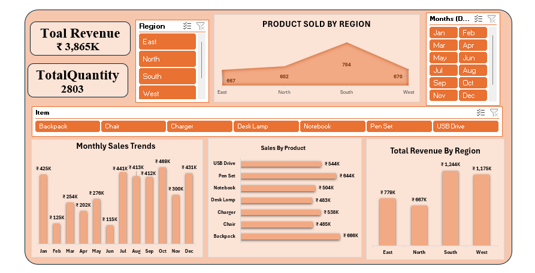

# 📊 Sales Performance Dashboard (Excel)

An interactive Excel dashboard built to track and analyze sales performance
across regions, products, and months — with dynamic slicers for real-time
filtering and insights.

## 🔑 Key Metrics
- **Total Revenue:** ₹2,023K
- **Total Quantity Sold:** 1,451 units

## 📌 Features
- **Interactive Slicers** — Filter by Region (East, North, South, West),
  Month (Jan–Dec), and Item (Backpack, Chair, Charger, Desk Lamp, Notebook,
  Pen Set, USB Drive)
- **Product Sold by Region** — Area chart comparing East vs South performance
- **Monthly Sales Trends** — Bar chart of revenue across all 12 months
- **Sales by Product** — Horizontal bar chart ranking items by revenue
- **Total Revenue by Region** — Regional revenue comparison

## 🛠️ Tools Used
- Microsoft Excel (PivotTables, PivotCharts, Slicers, Dashboard Design)

## 📷 Preview

## 📂 Files
- `Sales_Performance_Dashboard.xlsx` — Full interactive dashboard file

## 💡 Insights
- South region generated significantly higher revenue (₹1,244K) than East (₹779K)
- Backpack and Notebook are top-performing products by revenue
- October recorded the highest monthly sales (₹337K)

## 👤 Author
Marigopi S 
